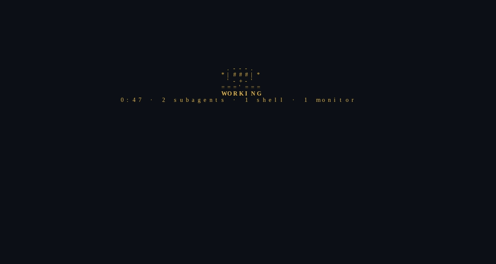
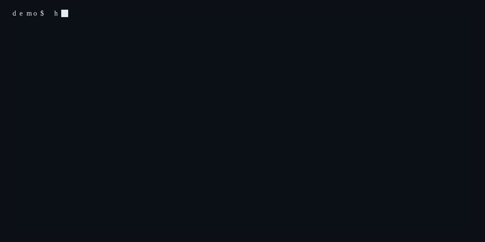

# status-herald (HERALD)


<p align="center">
  <a href="https://herald.muslewski.com"></a>
</p>


<p align="center">
  <a href="https://www.npmjs.com/package/status-herald"></a>
  <a href="https://github.com/muslewski/status-herald/discussions"></a>
  
  
</p>

<p align="center">
  <a href="https://herald.muslewski.com"></a>
</p>

<p align="center"><b>Site:</b> <a href="https://herald.muslewski.com">herald.muslewski.com</a></p>


Heads-up engine for terminal status surfaces.

<p align="center"></p>

### Curtain denizens

Non-classic themes put a **per-session creature** on the card — fox, cat, or owl — instead of a static mallet. Same animal every time for a given tmux session name; a grid of panes becomes a little cast.

```
   /\_/\         /\_/\           ,___,
  ( o.o )       (=^.^=)         ( o,o )
   > ^ <         (   )         /)   (\
    ~~~          |   |           "-"
    fox           cat            owl
```

Full lore, poses, and config: **[docs/BESTIARY.md](./docs/BESTIARY.md)**.

**Card chrome** (bottom-right, dim): click **`× off`** to pause the curtain for that session, **`↻ pet`** to cycle the animal. Keys: `x`/`o` = off, `a`/`p` = pet. Anywhere else = open the live pane (as before).

```bash
herald curtain pause          # same as × off (this session)
herald curtain resume         # curtains can cover again
herald curtain pet            # same as ↻ pet
```

## Curtain (phase 1)

Covers a working agent session pane (Claude Code, Grok Build, etc.) in a tmux
grid with an opaque status card; focus a card to open the live session.

### Install

```bash
npm install -g status-herald   # or: npx status-herald …
# bins: herald | status-herald
herald curtain install         # wire hooks (~/.claude/settings.json for Claude + Grok compat)
herald curtain doctor
```

From a git checkout (dev):

```bash
npm install            # dev deps only (biome); zero runtime deps
npm link               # put `herald` on PATH
herald curtain install
```

`install` wires one payload-aware command onto `UserPromptSubmit`,
`SubagentStart`, `SubagentStop`, `Stop` and `Notification`, and removes the
older `herald curtain event <state>` hooks if it finds them. Already-running
sessions pick the change up at their next hook event — no restart needed.

The wired command is **absolute** — `"<node>" "<…/bin/herald>" curtain hook`,
resolved from the node running `install`. A hook fires in whatever environment
the agent hands it (Grok's standalone binary, a non-login shell, a
systemd-spawned session), and a bare `herald` exits 127 there before any code
runs — silently, because hooks fail open. That is why the card used to freeze
for Grok and for some Claude tabs. `install` migrates any bare or stale wiring
to the absolute form and re-resolves it, so a node upgrade self-heals on the
next `install`. Run `herald curtain doctor` to confirm the wired command
resolves; `herald curtain inspect` shows each session's state, in-flight
counts, and how long ago its last hook landed.

<details><summary>▶ demo — curtain inspect</summary>
<p></p>
</details>

For native Grok (no .claude dir):
```bash
herald curtain install grok   # or --grok
# writes ~/.grok/hooks/herald.json (Grok loads global hooks from here)
```

Grok also reads `~/.claude/settings.json` via compatibility layer, so the
default `install` gives working tmux cards for Grok sessions too.

### Use

```bash
herald curtain up --slots 2 --cmd claude   # Claude grid
herald curtain up --slots 2 --cmd grok     # Grok Build grid
# from the Mac: ssh manjaro -t 'tmux attach -t grid'
herald curtain doctor                      # verify wiring (checks claude + grok)
herald curtain down                        # tear down
```

<details><summary>▶ demo — doctor</summary>
<p></p>
</details>

While a session works and its pane is unfocused it shows `● WORKING m:ss`;
finished panes show `✅ DONE`; blocked panes show `⚠ NEEDS YOU`. Click a card
to reveal the live session; click away to re-cover it while it is still
working.

Grok users: the same cards work. `herald curtain hook` normalizes Grok's
`hookEventName` / `approval_required` payloads (and synthesizes sub counts
from SubagentStart/Stop if no background_tasks present). 

### What the card knows about subagents

An agent session (Claude Code, Grok Build, ...) is a main agent plus whatever
subagents, watchers, and background shells it has dispatched, so "the turn
ended" and "the work finished" are not the same event. `Stop` typically means
the main turn ended (even with work still running).

`herald curtain hook` therefore reads each hook's stdin payload rather than
trusting its name (and normalizes Claude `hook_event_name` + Grok
`hookEventName`, `permission_prompt`/`approval_required`, etc.). Every hold on
`WORKING` is a **truth lease** (`subagent`, `watcher`, `bg_shell`, or `turn`)
with a TTL under `curtain.lease.*`. Expired leases stop counting without
another event — the card fails **idle**, not stuck-working:

- **live subagent leases** at `Stop` → stays `● WORKING · 2 subagents` when the
  host still reports them (Claude task list). A subagent keeps you from acting.
  On Grok (synthesis hosts) main-turn `Stop` does **not** wipe live subagent
  leases — kids keep `WORKING` until they drain (SubagentStop) or lease TTL /
  leak settle fires.
- **live watcher leases** (`/loop`, `scheduler_create`, `monitor`) at `Stop` →
  stays `● WORKING` until the watcher ends or its TTL expires (default 900s).
  Watchers no longer block settle forever.
- **background shells / tasks** at `Stop` → `✅ DONE · 1 task in bg`. A CI
  watch or long build does not hold the card on WORKING; the card just says so.
- `Notification` splits on `notification_type` (or `notificationType`):
  a `permission_prompt` (or Grok `approval_required`) is `⚠ NEEDS YOU`,
  an `idle_prompt` is `✅ DONE` — but an `idle_prompt` never overrides a
  permission prompt that is still waiting on you, and never calls a session
  done while subagent or watcher leases are still live.

A human `UserPromptSubmit` and a fresh `arm` clear leftover subagent leases so
a mismatched id cannot strand a card. Synthesis hosts also quiet-settle to
`DONE` when no live leases remain (see `curtain.settle.*`). If the agent PID
dies without a hook, the PID backstop forces `DONE`. Prefer a brief false
`DONE` over a tab that never settles: leases expire; they do not cling.

For Grok, subagent leases are synthesized from SubagentStart/Stop when the
payload lacks a task list. Full fidelity for Claude; good approx for Grok.

Grind Mode (Mac idle-nag) is phase 2 — separate spec.

## Works well with

Herald is standalone-first: **install only status-herald and you still get the
curtain cards and native bars** (context, state, clock, and the rest of the
defaults). Sibling tools are optional. When they are present, extras light up;
when they are absent, those extras stay empty — nothing errors. The shared
filesystem convention is documented in
[docs/AGENT-STATUS-PROVIDERS.md](docs/AGENT-STATUS-PROVIDERS.md)
([GitHub](https://github.com/muslewski/status-herald/blob/main/docs/AGENT-STATUS-PROVIDERS.md)).

### [token-oracle](https://github.com/muslewski/token-oracle)

Publishes `~/.local/share/token-oracle/forecast.json` (rate-limit / usage
windows). Herald's bar account segments (`account5h` / `accountWeekly`) and
Claude statusline gauges read that artifact via `bridge-token-oracle.mjs`
(override the ingest feed with `HERALD_TOKEN_FEED` if you need a custom path).
Oracle also writes agent-status session records; with
`curtain.lines.model: true` the curtain can show live model truth from those
records. Without oracle, account gauges simply have no data and stay blank.

### [agentic-sage](https://github.com/muslewski/agentic-sage)

Fleet / zone awareness. When sage is on `PATH`, herald can cache
`sage fleet --json` and — if you enable them — show a curtain zone line
(`curtain.lines.sageZone: true`) and a bar fleet segment
(`bars.segments.sage.enabled: true`). Without sage, those lines never appear;
curtain and bars keep working.

### [llm-armory](https://github.com/muslewski/llm-armory)

Launch labels for child sessions. Armory stamps long-TTL session records
(model, effort, preset, pid) at spawn time. With `curtain.lines.model: true`,
the card can render `model@effort` for armory children (and env hints like
`GROK_MODEL` / `LLM_PRESET` when no record is present). Without armory, herald
never looks for those launch records; optional model lines just stay off or
empty.

## Per-tab curtain (mosh)

Each Ghostty tab is a separate mosh'd tmux session. The curtain covers a
backgrounded tab with its status card and reveals the tab you switch to.
The box exposes these commands:

```bash
herald curtain arm [<session>]   # add a card window to a session (run inside it, or name it)
herald curtain disarm [<session>]  # remove it (run inside, or name it)
herald curtain cover <session>   # show the card (if working/done/needs)
herald curtain reveal <session>  # show the live session
herald curtain focus "<title>"   # reveal the tab whose label == title, cover the rest
herald curtain reveal-all        # panic: reveal everything
herald curtain pause [session]   # hold curtain open (copy text); no auto-cover
herald curtain resume [session]  # re-enable cover for that session
herald curtain pause-all         # hold every armed session open
herald curtain resume-all        # re-enable cover fleet-wide
herald curtain arm-all           # arm every session matching config's autoArm.sessionGlob
```

Fail-open: pressing any key in a card reveals its session, so a dead agent
never traps you. Idle sessions are never covered.

### The adapter model

The box never polls anything itself — it just reacts to `herald curtain
focus "<title>"`. What decides *when* to call that command, and with what
title, is an external **focus adapter**: any process, on any machine, that
can (a) learn which terminal tab/window is currently frontmost and (b) shell
out that one command (locally, or via `ssh <box> herald curtain focus ...`)
whenever the frontmost tab changes.

status-herald ships one reference adapter
(`scripts/focus-agent/ghostty-ssh-poll.sh`, below) that polls a Mac over ssh.
It is not the only way to drive the curtain — see "write your own adapter".

**Contract:** adapters always send the **raw** tab title. The box — not the
adapter — normalizes it via `curtain.focus.titleStripPrefixes` (stripping a
transport prefix like mosh's `"[mosh] "` and trimming) before matching it
against a session's window label. An adapter that pre-strips the title will
break matching for anyone whose config uses a different prefix.

A terminal's title follows tmux's *active* window, so a covered session would
otherwise advertise itself as `_curtain` — and focusing that tab would tell the
adapter "no session matches", covering everything instead of revealing the tab
you just clicked. To prevent that, `arm` pins the session's `set-titles-string`
so it always reports the **live** window's name, card or no card; `disarm`
removes the override. A covered tab therefore keeps its normal title, and
focusing it reveals it.

### Config reference

Config lives at `$HERALD_CONFIG`, else
`${XDG_CONFIG_HOME:-~/.config}/status-herald/config.json`. Missing file or
bad JSON ⇒ the defaults below (hook-safe, never throws). A config file only
needs to set the keys it wants to override — everything else deep-merges
from defaults. Run `herald config` to print the effective merged config.

The `curtain` block, with its defaults:

```json
{
  "enabled": true,
  "coverableStates": ["working", "done", "needs"],
  "focus": {
    "source": "ssh-osascript",
    "pollMs": 350,
    "eventFile": "$HOME/.local/state/status-herald/focus-events",
    "heartbeatSec": 20,
    "ssh": { "host": "mac-music", "connectTimeout": 4 },
    "terminalApp": "ghostty",
    "titleStripPrefixes": ["[mosh] "]
  },
  "autoArm": { "enabled": true, "sessionGlob": "*" }
}
```

- `enabled` — kill switch; when `false` every per-tab verb (`arm`, `disarm`,
  `cover`, `reveal`, `reveal-all`, `pause`, `resume`, `pause-all`,
  `resume-all`, `focus`, `arm-all`) no-ops.
- `coverableStates` — session states eligible to be covered by a card.
- `focus.source` — which reference adapter the dispatcher (`run.sh`) runs:
  `"ssh-osascript"` (poll, the default + agent-free fallback) or
  `"ghostty-hammerspoon"` (event-driven stream; needs the Mac emitter).
- `focus.pollMs` — how often the **poll** adapter re-reads the frontmost tab
  title (ignored by the event-driven adapter).
- `focus.eventFile` — path **on the Mac** the Hammerspoon emitter appends to and
  the stream adapter tails. Expanded by the remote shell, so use `$HOME`, not
  `~` (tilde does not expand inside the quoted remote `tail`).
- `focus.heartbeatSec` — how often the emitter writes a keepalive line; the
  stream adapter treats no line for `2*heartbeatSec+5`s as a dead emitter and
  restarts.
- `focus.ssh.host` / `focus.ssh.connectTimeout` — the ssh target (an ssh
  config alias or `user@host`) and its connect timeout, in seconds.
- `focus.terminalApp` — the macOS app name the adapter checks is frontmost
  (`osascript`'s `name of fp`) before reading its window title.
- `focus.titleStripPrefixes` — ordered list of prefixes the box strips (first
  match wins) before comparing an incoming title to session window labels.
- `sound` — **default off**. On the edge into `needs` (approval / permission),
  fire pluggable backends (`command` / `local` / `ssh` / `ntfy`). Modes:
  `day` | `night` | `off`. CLI: `herald curtain sound …`. See
  [getting started — attention sound](./docs/getting-started.md#attention-sound-optional).
- `autoArm.enabled` / `autoArm.sessionGlob` — whether `herald curtain arm-all`
  is allowed to run, and which tmux sessions it arms (`*` = all,
  `prefix*` = glob-matched, or an exact name).
- `tmuxBar.whenCovered` — while a session is covered, `transparent` drops the tmux status bar's background and restores it on reveal. Default `"keep"`.

### Curtain themes

Themes control the card's look. Pick a default and bind themes to sessions by
name glob:

```json
{
  "curtain": {
    "theme": "minimal",
    "themeBySession": {
      "token-oracle*": "forge",
      "syndcast*": "minimal"
    },
    "animation": { "fps": 2 }
  }
}
```

Built-ins: `classic` (solid black, the default), `minimal` (transparent —
your terminal background shows through), `forge` (transparent + animated art).
Author your own under `curtain.themes.<name>`:

```json
{
  "curtain": {
    "theme": "mine",
    "themes": {
      "mine": {
        "background": "transparent",
        "states": {
          "working": { "fg": 33, "label": "WORKING",
            "frames": [["  >>>  "], ["  >>>> "]] }
        }
      }
    }
  }
}
```

`frames` is an array of frames; each frame is an array of lines. A single-frame
state is static. Paste art from `figlet`/`toilet` or draw your own. After
changing a theme, run `herald curtain refresh` to reach already-armed sessions.

### ssh-poll quickstart

The reference adapter (`scripts/focus-agent/ghostty-ssh-poll.sh`) is plain
bash + `ssh` + `node` (for zero-dep JSON parsing of `herald config`) — no
runtime deps beyond what the box already requires.

```bash
# 1. Grant macOS Accessibility to the ssh path: System Settings -> Privacy &
#    Security -> Accessibility -> add /usr/sbin/sshd. That's the process
#    that runs the remote `osascript` call when a command arrives over ssh,
#    and it needs permission to read window titles via System Events.
# 2. Make sure `ssh.host` (or its ssh-config alias, e.g. `mac-music`)
#    resolves and logs in non-interactively (BatchMode=yes, key-based auth).
# 3. Verify the read path end-to-end -- no tmux/curtain mutation:
scripts/focus-agent/ghostty-ssh-poll.sh --once
# -> prints the Mac's frontmost Ghostty tab title (blank if Ghostty isn't
#    frontmost)
```

Once `--once` prints a title, the same script with no flags runs the
unbounded poll loop used by the systemd unit below. `--sentinel FILE` (exit
once `FILE` disappears) and `--max SEC` (exit after a time budget) are for
bounded/manual test runs.

### Event-driven (Hammerspoon) adapter

The poll adapter reads the Mac ~every `pollMs`; the event-driven adapter reacts
the instant a Ghostty window/tab is focused, with **zero** idle cost. It needs a
small emitter running on the Mac (Hammerspoon) plus `source: "ghostty-hammerspoon"`.

```bash
# On the Mac:
# 1. Install Hammerspoon (https://www.hammerspoon.org) and grant it
#    Accessibility (System Settings -> Privacy & Security -> Accessibility).
# 2. Install the emitter and load it from your Hammerspoon config:
mkdir -p ~/.hammerspoon
cp mac/herald-focus.lua ~/.hammerspoon/herald-focus.lua      # from a repo checkout
printf '\ndofile(hs.configdir .. "/herald-focus.lua")\n' >> ~/.hammerspoon/init.lua
# 3. Reload Hammerspoon (console: hs.reload()). The console prints
#    "herald-focus emitter armed -> <event file>".

# On the box: point the config at the stream adapter, then restart the service.
#   curtain.focus.source = "ghostty-hammerspoon"
```

The emitter's `EVENT_FILE`, `APP_NAME`, and `HEARTBEAT_SEC` constants must match
`curtain.focus.eventFile` (with `$HOME` expanded), `terminalApp`, and
`heartbeatSec`. The stream adapter falls back to a one-shot osascript read on
startup and after any reconnect, so state is always correct even across a Mac
sleep or a Hammerspoon restart.

### systemd install (opt-in)

```bash
mkdir -p ~/.local/share/status-herald ~/.config/systemd/user
cp scripts/focus-agent/run.sh \
   scripts/focus-agent/ghostty-ssh-poll.sh \
   scripts/focus-agent/ghostty-hammerspoon-stream.sh \
   ~/.local/share/status-herald/
cp contrib/systemd/status-herald-curtain.service ~/.config/systemd/user/
systemctl --user daemon-reload
systemctl --user enable --now status-herald-curtain

systemctl --user status status-herald-curtain   # confirm active
journalctl --user -u status-herald-curtain -f   # watch it poll
```

The unit's `ExecStartPre` runs `herald curtain arm-all` on every start so
newly created sessions get armed automatically per `autoArm.sessionGlob`;
`Restart=on-failure` keeps the poller alive across transient ssh drops.

### Write your own adapter

The box's whole surface area is `herald curtain focus "<title>"` (plus
`arm`/`disarm`/`cover`/`reveal`/`reveal-all`/`pause`/`resume`/
`pause-all`/`resume-all`/`arm-all` for setup and
recovery) — any adapter that calls it on tab-focus-change qualifies. Poll,
or subscribe to native OS events; run on the box itself, over ssh, or push
through a queue. Only rule: send the **raw** title and let the box normalize.

`mac/herald-focus.lua` is the shipped event-driven adapter: a Hammerspoon
(`hs.window.filter` + `hs.application.watcher`) emitter that appends the
frontmost Ghostty title to an event file the moment focus changes, which
`scripts/focus-agent/ghostty-hammerspoon-stream.sh` tails over ssh into `herald
curtain focus` — no polling, no per-event ssh round trip. See "Event-driven
(Hammerspoon) adapter" above. `mac/herald-spike.lua` remains as the minimal
Phase-0 demo.

Test it over mosh without any adapter:

```bash
herald curtain arm syndcast
tmux set -t syndcast @herald_state working
ssh <box> herald curtain cover syndcast   # flip to the syndcast tab -> card
ssh <box> herald curtain reveal syndcast  # -> live session
```

## Community

- **Website:** [herald.muslewski.com](https://herald.muslewski.com)
- **Questions & ideas:** [Discussions](https://github.com/muslewski/status-herald/discussions)
- **Bugs & features:** [Issues](https://github.com/muslewski/status-herald/issues/new/choose)
- **Contributing:** [CONTRIBUTING.md](./CONTRIBUTING.md)
- **Code of Conduct:** [CODE_OF_CONDUCT.md](./CODE_OF_CONDUCT.md)
- **Security:** [SECURITY.md](./SECURITY.md) (private reports only)
- **Support matrix:** [SUPPORT.md](./SUPPORT.md)

If you're not sure whether something is a bug, **start a Discussion** — maintainers can promote it to an issue when it is.
